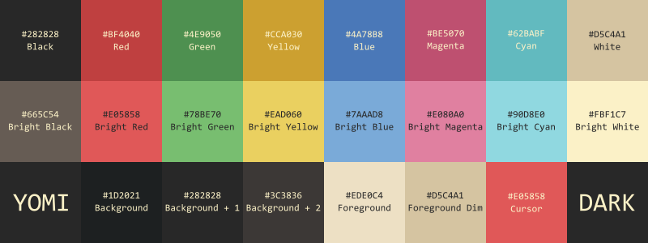
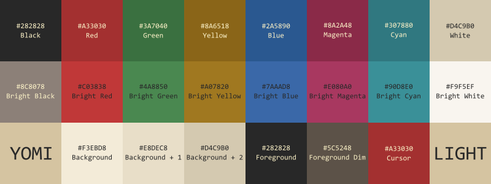
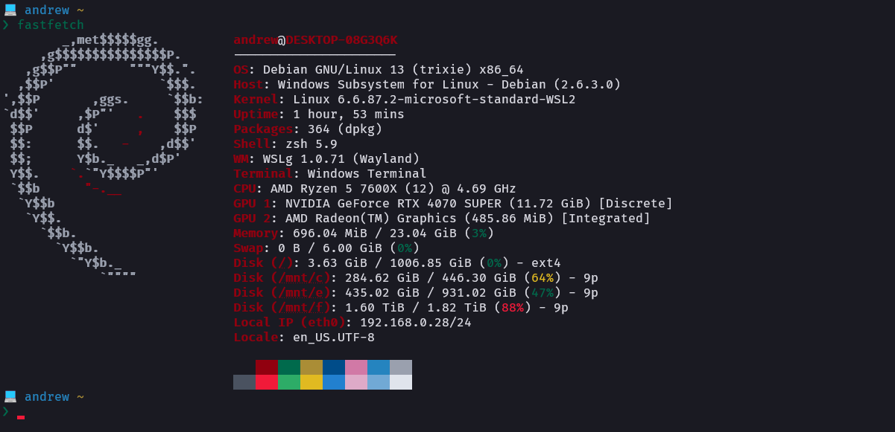
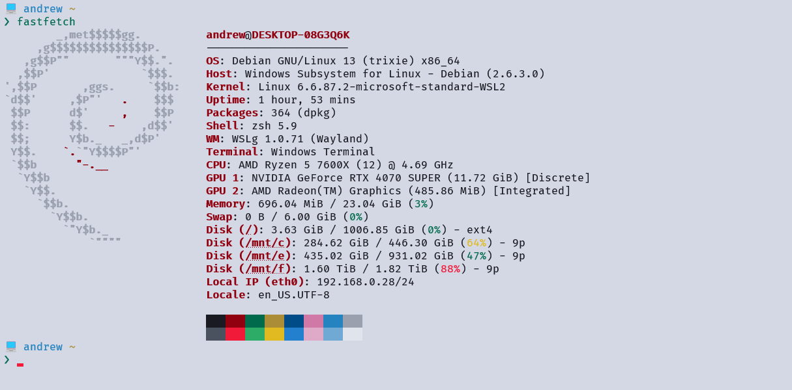

# yomi

> *"I decided long ago to drink only hot tea, which cools the blood."*

A terminal color scheme with accent colors drawn from a place where the living and the dead share the same sky.




---

## Preview




---

## Palette

### Dark

| Slot | Hex | Role |
|------|-----|------|
| Background | `#1D2021` | Hard dark surface |
| Background +1 | `#282828` | Raised surfaces |
| Background +2 | `#3C3836` | Selection |
| Foreground | `#EDE0C4` | Primary text |
| Foreground Dim | `#D5C4A1` | Dimmed text |
| Cursor | `#E05858` | — |
| | | |
| Black | `#282828` | — |
| Red | `#BF4040` | Errors |
| Green | `#4E9050` | Success / additions |
| Yellow | `#CCA030` | Warnings / modified |
| Blue | `#4A78B8` | Directories / info |
| Magenta | `#BE5070` | Special / branches |
| Cyan | `#62BABF` | Links / prompts |
| White | `#D5C4A1` | — |
| | | |
| Bright Black | `#665C54` | Comments |
| Bright Red | `#E05858` | — |
| Bright Green | `#78BE70` | — |
| Bright Yellow | `#EAD060` | — |
| Bright Blue | `#7AAAD8` | — |
| Bright Magenta | `#E080A0` | — |
| Bright Cyan | `#90D8E0` | — |
| Bright White | `#FBF1C7` | — |

### Light

| Slot | Hex | Role |
|------|-----|------|
| Background | `#F3EBD8` | Warm parchment |
| Background +1 | `#E8DEC8` | Raised surfaces |
| Background +2 | `#D4C9B0` | Selection |
| Foreground | `#282828` | Primary text |
| Foreground Dim | `#5C5248` | Dimmed text |
| Cursor | `#A33030` | — |
| | | |
| Black | `#282828` | — |
| Red | `#A33030` | Errors |
| Green | `#3A7040` | Success / additions |
| Yellow | `#8A6518` | Warnings / modified |
| Blue | `#2A5890` | Directories / info |
| Magenta | `#8A2A48` | Special / branches |
| Cyan | `#307880` | Links / prompts |
| White | `#D4C9B0` | — |
| | | |
| Bright Black | `#8C8078` | Comments |
| Bright Red | `#C03838` | — |
| Bright Green | `#4A8850` | — |
| Bright Yellow | `#A07820` | — |
| Bright Blue | `#3A68A8` | — |
| Bright Magenta | `#A83860` | — |
| Bright Cyan | `#3A9098` | — |
| Bright White | `#F9F5EF` | — |

---

## Installation

### Windows Terminal

1. Press `Ctrl+,` to open Settings, then click **Open JSON file** (bottom-left)
2. Find the `"schemes"` array and paste the contents of
   [`ports/windows-terminal/yomi.windows-terminal.json`](./ports/windows-terminal/yomi.windows-terminal.json)
   (or [`yomi-light.windows-terminal.json`](./ports/windows-terminal/yomi-light.windows-terminal.json)) as a new object inside it
3. Save, then go to your profile → **Appearance** and set **Color scheme** to `yomi` or `yomi-light`

### Vim / Neovim

Copy the file to your colors directory:

```sh
# Vim
cp ports/vim/yomi.vim ~/.vim/colors/

# Neovim
cp ports/vim/yomi.vim ~/.config/nvim/colors/
```

Then in your `vimrc` or `init.vim`:

```vim
colorscheme yomi
" light variant:
colorscheme yomi-light
```

### VS Code

Copy the extension folder into your extensions directory and restart VS Code:

```sh
cp -r ports/vscode ~/.vscode/extensions/yomi
```

Then open the Command Palette → **Preferences: Color Theme** → select **yomi** or **yomi Light**.

---

## Repo structure

```
yomi/
├── assets/
│   ├── yomi-dark-swatch.png
│   ├── yomi-light-swatch.png
│   ├── yomi-dark-terminal.png
│   └── yomi-light-terminal.png
├── ports/
│   ├── vim/
│   │   ├── yomi.vim                              # Vim / Neovim (dark)
│   │   └── yomi-light.vim                        # Vim / Neovim (light)
│   ├── vscode/
│   │   ├── package.json
│   │   └── themes/
│   │       ├── yomi.json                         # VS Code (dark)
│   │       └── yomi-light.json                   # VS Code (light)
│   └── windows-terminal/
│       ├── yomi.windows-terminal.json            # Windows Terminal (dark)
│       └── yomi-light.windows-terminal.json      # Windows Terminal (light)
├── LICENSE
└── README.md
```

---

## License

MIT — see [LICENSE](./LICENSE).