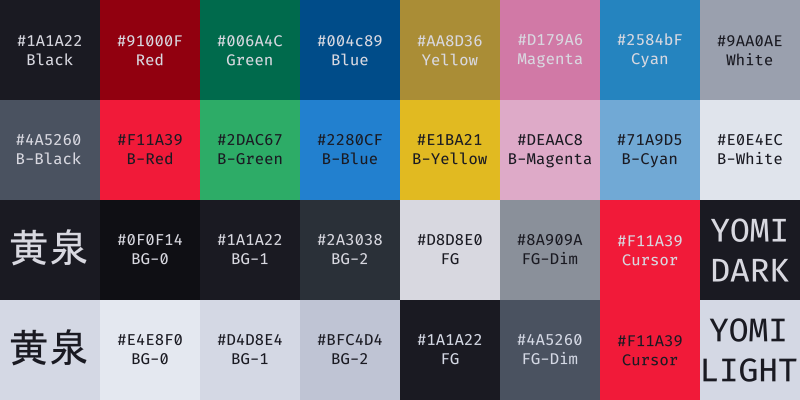

# yomi

> *"Any prize that is worth having requires risk."*

A terminal color scheme with accent colors drawn from a place where the living and the dead share the same sky.



---

## Preview

### Yomi Medium 

### Yomi Light Medium


---

## Palette

### Dark

| Slot            | Hex       | Role                  | Color Name      |
|-----------------|-----------|-----------------------|-----------------|
| Background      | `#0F0F14` | —                     | Onyx            |
| Background +1   | `#1A1A22` | Raised surfaces       | Shadow Grey     |
| Background +2   | `#2A3038` | Selection             | Jet Black       |
| Foreground      | `#D8D8E0` | Primary text          | Alabaster Grey  |
| Foreground Dim  | `#8A909A` | Dimmed text           | Lavender Grey   |
| Cursor          | `#F11A39` | —                     | Punch Red       | 
|                 |           |                       |                 | 
| Black           | `#1A1A22` | —                     | Shadow Grey     |
| Red             | `#91000F` | Errors                | Deep Crimson    |
| Green           | `#006A4C` | Success / additions   | Dark Emerald    |
| Yellow          | `#AA8D36` | Warnings / modified   | Dark Goldenrod  |
| Blue            | `#004C89` | Directories / info    | Steel Azure     |
| Magenta         | `#D179A6` | Special / branches    | Sweet Peony     |
| Cyan            | `#2584BF` | Links / prompts       | Ocean Blue      |
| White           | `#9AA0AE` | —                     | Cool Steel      |
|                 |           |                       |                 |
| Bright Black    | `#4A5260` | Comments              | Charcoal Blue   |
| Bright Red      | `#F11A39` | —                     | Punch Red       |
| Bright Green    | `#2DAC67` | —                     | Jungle Green    |
| Bright Yellow   | `#E1BA21` | —                     | Saffron         |
| Bright Blue     | `#2280CF` | —                     | Steel Blue      |
| Bright Magenta  | `#DEAAC8` | —                     | Pink Orchid     |
| Bright Cyan     | `#71A9D5` | —                     | Cool Horizon    |
| Bright White    | `#E0E4EC` | —                     | Alice Blue      |

### Light

| Slot            | Hex       | Role                  | Color Name      |
|-----------------|-----------|-----------------------|-----------------|
| Background      | `#E4E8F0` | —                     | Alice Blue      |
| Background +1   | `#D4D8E4` | Raised surfaces       | Lavender        |
| Background +2   | `#BFC4D4` | Selection             | Pale Slate      |
| Foreground      | `#1A1A22` | Primary text          | Shadow Grey     |
| Foreground Dim  | `#4A5260` | Dimmed text           | Charcoal Blue   |
| Cursor          | `#F11A39` | —                     | Punch Red       |
|                 |           |                       |                 |
| Black           | `#1A1A22` | —                     | Shadow Grey     |
| Red             | `#91000F` | Errors                | Deep Crimson    |
| Green           | `#006A4C` | Success / additions   | Dark Emerald    |
| Yellow          | `#AA8D36` | Warnings / modified   | Dark Goldenrod  |
| Blue            | `#004C89` | Directories / info    | Steel Azure     |
| Magenta         | `#D179A6` | Special / branches    | Sweet Peony     |
| Cyan            | `#2584BF` | Links / prompts       | Ocean Blue      |
| White           | `#9AA0AE` | —                     | Cool Steel      |
|                 |           |                       |                 |
| Bright Black    | `#4A5260` | Comments              | Charcoal Blue   |
| Bright Red      | `#F11A39` | —                     | Punch Red       |
| Bright Green    | `#2DAC67` | —                     | Jungle Green    |
| Bright Yellow   | `#E1BA21` | —                     | Saffron         |
| Bright Blue     | `#2280CF` | —                     | Steel Blue      |
| Bright Magenta  | `#DEAAC8` | —                     | Pink Orchid     |
| Bright Cyan     | `#71A9D5` | —                     | Cool Horizon    |
| Bright White    | `#E0E4EC` | —                     | Alice Blue      |

---

## Installation

### Windows Terminal

1. Press `Ctrl+,` to open Settings, then click **Open JSON file** (bottom-left)
2. Find the `"schemes"` array and paste the contents of
   [`ports/windows-terminal/yomi.windows-terminal.json`](./ports/windows-terminal/yomi.windows-terminal.json)
   (or [`yomi-light.windows-terminal.json`](./ports/windows-terminal/yomi-light.windows-terminal.json)) as a new object inside it
3. Save, then go to your profile → **Appearance** and set **Color scheme** to `yomi` or `yomi-light`

> **Windows — PowerShell users:** PowerShell maps its own syntax colors to the 16-color palette independently of your terminal theme. If you see low-contrast colors in PowerShell, in light mode (commonly yellow commands on a light background), add the following to your PowerShell profile (`notepad $PROFILE`):  
>
> ```powershell
> Set-PSReadLineOption -Colors @{
>     Command   = '#2DAC67'
>     Parameter = '#71A9D5'
>     String    = '#004C89'
>     Operator  = '#DEAAC8'
>     Variable  = '#91000F'
>     Comment   = '#4A5260'
>     Keyword   = '#F11A39'
> }
> ```
>
> Adjust the color assignments to your preference. This overrides PSReadLine's palette mapping with direct hex values, ensuring consistent rendering in both light and dark variants.

### Vim / Neovim

Copy the file to your colors directory:

```sh
# Vim
cp ports/vim/yomi.vim ~/.vim/colors/

# Neovim
cp ports/vim/yomi.vim ~/.config/nvim/colors/
```

Then in your `vimrc` or `init.vim`:

```vim
colorscheme yomi
" light variant:
colorscheme yomi-light
```

### VS Code

1. Copy the extension folder into your VS Code extensions directory:

**macOS / Linux**
```sh
cp -r ports/vscode/AndrewFila.yomi-1.0.0 ~/.vscode/extensions/
```

**Windows (PowerShell)**
```powershell
Copy-Item -Recurse ports\vscode\AndrewFila.yomi-1.0.0 $env:USERPROFILE\.vscode\extensions\
```

2. Fully close and reopen VS Code
3. Open the Command Palette (`Ctrl+Shift+P`) → **Preferences: Color Theme** → select a yomi variant

> The extension will be available on the VS Code Marketplace soon.
---

## Repo structure

```
yomi/
├── assets/
│   ├── yomi-dark-swatch.png
│   ├── yomi-light-swatch.png
│   ├── yomi-dark-terminal.png
│   └── yomi-light-terminal.png
├── ports/
│   ├── vim/
│   │   ├── yomi.vim                              # Vim / Neovim (dark)
│   │   └── yomi-light.vim                        # Vim / Neovim (light)
│   ├── vscode/
│   │   ├── package.json
│   │   └── themes/
│   │       ├── yomi.json                         # VS Code (dark)
│   │       └── yomi-light.json                   # VS Code (light)
│   └── windows-terminal/
│       ├── yomi.windows-terminal.json            # Windows Terminal (dark)
│       └── yomi-light.windows-terminal.json      # Windows Terminal (light)
├── LICENSE
└── README.md
```

---

## License

MIT — see [LICENSE](./LICENSE).